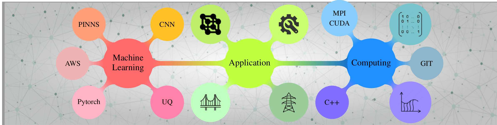

<!--```mermaid
mindmap
</br>
  ((Scientific Computing))
    ((FEM))
    ((LAMMPS))
    ((C, C++))
    ((MPI, CUDA))
  ((Scientific ML))
    ((CNN / PINNs))
    ((Uncertainty Quantification))
    ((Active Learning))
    ((Python, PyTorch, Tensorflow))
```-->


 
[](https://scholar.google.com/citations?user=Zx4v13gAAAAJ&hl=en)
[](https://orcid.org/0000-0003-4445-8817)
[](https://www.webofscience.com/wos/author/record/AFY-6130-2022)
[](https://www.linkedin.com/in/ashriva16/)
[](https://www.ashriva.in)

# 👋 Hi, I am Ankit Shrivastava

🔬 Researcher | Data Scientist | Scientific ML   
🏢 Oak Ridge National Laboratory | Knoxville, TN, USA  
<!--🌐 [ashriva.in](https://www.ashriva.in) | 📫 [contact@ashriva.in](mailto:contact@ashriva.in)-->

---

## 🧠 About Me

I'm a researcher working at the intersection of materials science, machine learning, and data-driven experimentation. I specialize in **scientific machine learning (SciML)**, **numerical modeling**, and **optimization of physical systems**. At Oak Ridge National Laboratory, I develop intelligent experimentation strategies to accelerate scientific discovery.

---

## 🧪 Core Expertise


- 🧠 Scientific Machine Learning (SciML) 
- 🧮 Numerical Modeling & Simulation  
- 🔁 Bayesian Optimization & Active Learning  
- 🧪 Experimental Design & Autonomous Labs  
- 📊 Scientific Data Analysis & Visualization

---

## 📂 Featured Projects

- **[bayesian-optimization-sputter-deposition](https://github.com/ashriva16/bayesian-optimization-sputter-deposition):**  
  Bayesian optimization for tuning thin-film deposition parameters.

- **[INTERSECT-DIAL/dial](https://github.com/INTERSECT-DIAL/dial):**  
  A data-informed active learning framework for sequential experiments.

---

## 📚 Publications & Academic Work

📖 View my research on [Google Scholar](https://scholar.google.com/citations?user=Zx4v13gAAAAJ&hl=en)

Topics include:
- ML-guided materials synthesis
- Intelligent automation in experimental workflows
- SciML and simulation-informed decision making

---

## 📈 GitHub Stats


---

## 🗓️ GitHub Activity Graph

[](https://github.com/ashriva16)

---

## 🌐 Let's Connect

- 🔗 [LinkedIn](https://www.linkedin.com/in/ashriva16/)
- 🧑‍💻 [Personal Website](https://www.ashriva.in)

---

Thanks for visiting! You can explore my projects or reach out to collaborate.

<!--
**ashriva16/ashriva16** is a ✨ _special_ ✨ repository because its `README.md` (this file) appears on your GitHub profile.

Here are some ideas to get you started:

- 🔭 I’m currently working on ...
- 🌱 I’m currently learning ...
- 👯 I’m looking to collaborate on ...
- 🤔 I’m looking for help with ...
- 💬 Ask me about ...
- 📫 How to reach me: ...
- 😄 Pronouns: ...
- ⚡ Fun fact: ...
-->
